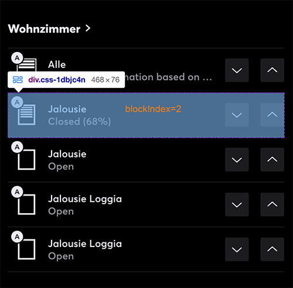
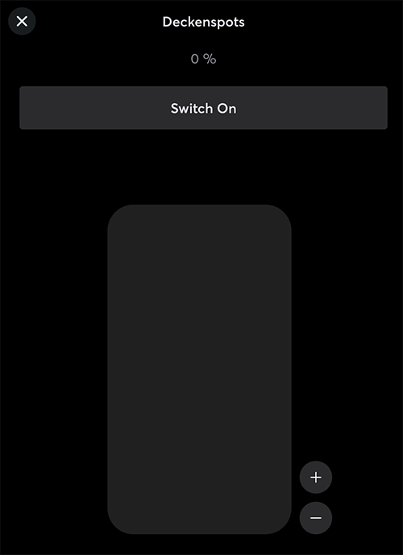

# loxobomised

A super stupid puppeteer remote control for Loxone smart home systems

## Prerequisites:

- [node.js](https://nodejs.org)
- [yarn](https://yarnpkg.com) (optional)

## Get started

1. Add a `.env` file in project root with the following structure:

```javascript
MINI_SERVER_ID=<id-of-your-server-grabbed-from-webinterface>
LOGIN=Mieter
PASSWORD=Password
APARTMENT=05.18
PORT=3000
```

2. Install all dependencies by running `npm install` (or just `yarn`)
3. Start it with `npm start:pm2` (or `yarn start:pm2`)

#### Where to find the mini server ID?

> This is only valid for tenants living at "Jägerstrasse 59" in Winterthur.

Check your mails, you certainly received emails from "Living Services" portal - just search for one of those mails and open the "Living Services" App in a browser on your desktop computer. In there, you have this "Loxone" link, open that and login with the credentials you received by Wincasa (if you don't know the credentials, ask Wincasa in a Support Ticket).

After you logged in succesful into the loxone web interface, you can simply check your URL - all digits after the last `/` are representing your mini server ID.

## How to use

The project will start an express server and a pool of singleton puppeteer instances logged-in to the loxone web interface.
The pool will hold one puppeteer `page` instance per category.

You can simply make fetch requests in the format:

`http://localhost:4000/exec/jalousie/Wohnzimmer/1/50?tilt=1`

This would control the jalousie index 1 in room "Wohnzimmer", moving it to 50% and tilt the blinds a little bit (tilt=1).

## URL format

The format is like this: `/exec/:device/:room/:blockIndex/:value`

Loxobomised supports three different types of devices: `jalousie`, `light` and `ventilation`.

The `:value` can be a number or a string, depending on the device type. A `jalousie` can be controlled in percent, so it would be a numeric value between 0 and 100. The device `light` can also receive percent values, depending if the controlled light is dimmable or not - otherwise it would just be "Switch On" or "Switch Off". A `ventilation` can only receive strings like "Stufe 2" or "Aus" - you can click on every action that appears on the control overlay in loxone web interface.

The last important value would be the `:blockIndex`. What is it?

We navigate trough the web interface by selecting the title of a room like "Wohnzimmer" and then we just make an XPath to retreive the controls underneath it, by the index in XPath. As xpath starts to count at "1", the first block just underneath the title would be 1, then 2 and so on.

You can open the web interface yourself in a browser and simply go to a category like `Beschattung`, search for your room and then check, which control block you want to press and which index it would have:



## Jalousie

Can be controlled with percent values - 0 means fully up and 100 means fully down.

### Tilt

Additional to the default route params, a `jalousie` device supports an additional query parameter: `tilt`

This can be used to control the final position of the jalousie blinds: a tilt of 0 means "closed", 1 would be "tilted" and 2 is "open".

CAUTION! The parameter is also used to determine if it is a jalousie with blinds or just a "Markise". This means, if you want to control the markise on your balcony, never use `tilt`! The markise cannot be controlled in the way we control normal jalousie with blinds and just won't work if you pass the tilt parameter.

### Type

As we cannot set a percent value directly, we just move the jalousie and wait for a certain time to reach the position. For this reason, we need to know what jalousie you want to move: `Window` or `Loggia` where Window are all default jalousies and Loggia is for the big big windows on our balcony. When you don't control this value in the query, default is `Window`.

### Examples

```yaml
# Set balcony markise to 100% (fully down)
http://localhost:4000/exec/jalousie/Loggia/1/100

# Set livingroom first jalousie to 30% and tilt it to "open"
http://localhost:4000/exec/jalousie/Wohnzimmer/2/30?tilt=2

# Set livingroom second jalousie to 15% and tilt it to "open", type "Loggia" for the big big windows
http://localhost:4000/exec/jalousie/Wohnzimmer/4/15?tilt=2&type=Loggia
```

## Light

Check with the loxone web interface if a light is dimmable - by clicking on the whole "block" of a device, you open the "overlay controls". For example, it looks like this with a dimmable spot:



If the controls are having the percent value on top and the "plus"/"minus" buttons, then it is dimmable and can be controlled with numeric values, representing the percent you want to set.

CAUTION! It only supports steps by 10% - you cannot set a lamp to 54%!

### Examples

```yaml
# Set kitchen light to 60% (dimmed)
http://localhost:4000/exec/light/Küche/1/60

# Turn on spots in entrance
http://localhost:4000/exec/jalousie/Entrée/1/Switch On
```

## Ventilation

This one only supports certain levels to set like `Aus`, `Stufe 1`, `Stufe 2` or `Free cooling`.

### Examples

```yaml
# Set livingroom ventilation to 2
http://localhost:4000/exec/ventilation/Wohnzimmer/1/Stufe 2

# Turn off bedroom ventilation
http://localhost:4000/exec/ventilation/Zimmer 1/1/Aus
```

## Integration with Home Assistant

You can easily integrate these GET requests with the built in shell feature. You just extend your `configuration.yaml` like:

```bash
shell_command:
  light_kitchen_60: 'curl -X GET "http://localhost:4000/exec/light/Küche/1/60"'

  jalousie_livingroom_0: 'curl -X GET "http://localhost:4000/exec/jalousie/Wohnzimmer/2/0?tilt=0"'
  jalousie_livingroom_60_1: 'curl -X GET "http://localhost:4000/exec/jalousie/Wohnzimmer/2/60?tilt=1"'
  jalousie_livingroom_100: 'curl -X GET "http://localhost:4000/exec/jalousie/Wohnzimmer/2/100?tilt=0"'
```

Then you just create scripts and call these shell commands and PROFIT!
